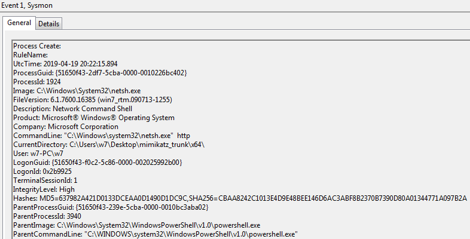
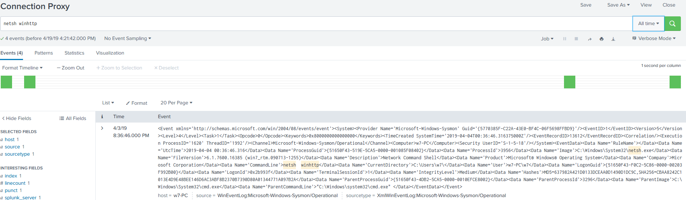

# Technique Description
## Connection Proxy - T1090
## [Description from ATT&CK](https://attack.mitre.org/techniques/T1090/)
<blockquote>
A connection proxy is used to direct network traffic between systems or act as an intermediary for network communications. Many tools exist that enable traffic redirection through proxies or port redirection, including HTRAN, ZXProxy, and ZXPortMap. [1]

The definition of a proxy can also be expanded out to encompass trust relationships between networks in peer-to-peer, mesh, or trusted connections between networks consisting of hosts or systems that regularly communicate with each other.
</blockquote>

# Assumption
Users should never be modifying proxy settings for their system any use of netsh to change proxy settings is considered not normal user activity.

# Execution
[Instructions](https://www.thewindowsclub.com/reset-winhttp-proxy-settings-windows)

# Detection

## Visibility
Sysmon log entry

## Splunk Filter
Search Term: netsh winhttp

