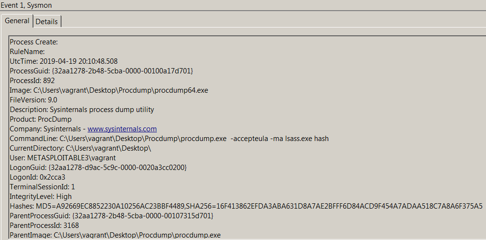
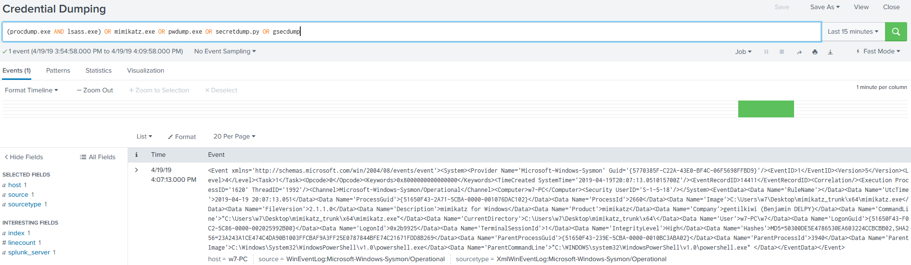

# Technique Description
## Credential Dumping - T1003
## [Description from ATT&CK](https://attack.mitre.org/techniques/T1003/)
<blockquote>
Credential dumping is the process of obtaining account login and password information, normally in the form of a hash or a clear text password, from the operating system and software. Credentials can then be used to perform Lateral Movement and access restricted information.

Several of the tools mentioned in this technique may be used by both adversaries and professional security testers. Additional custom tools likely exist as well.
</blockquote>

# Assumption
This assumes that credential dumping attempts performed by malicious actors would be done using: procdump.exe, mimikatz.exe, pwdump.exe, secretdump.py, or gsecdump.exe.

# Execution
Run [credentialDump.bat](/Scripts/credentialDump.bat)

# Detection

## Visibility
Sysmon log event

## Splunk Filter
Search Term: (procdump.exe AND lsass.exe) OR mimikatz.exe OR pwdump.exe OR secretdump.py OR gsecdump.exe

