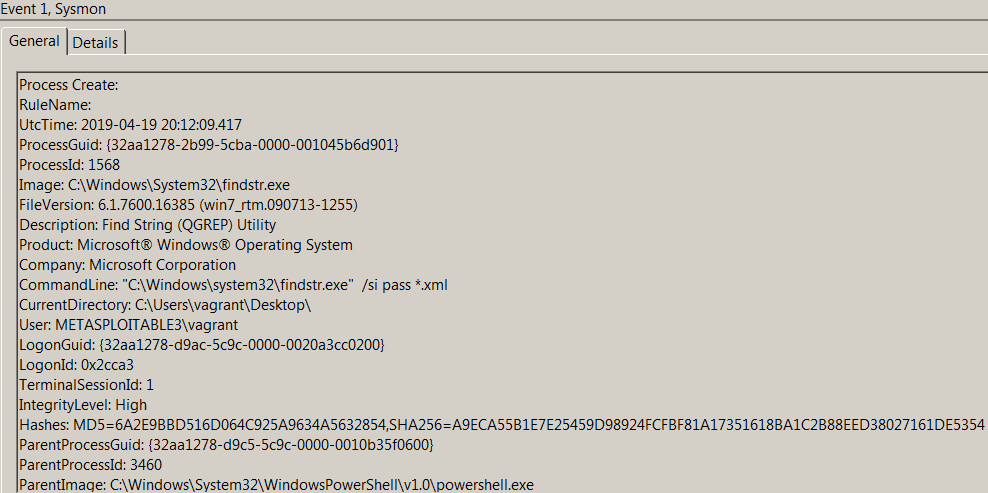
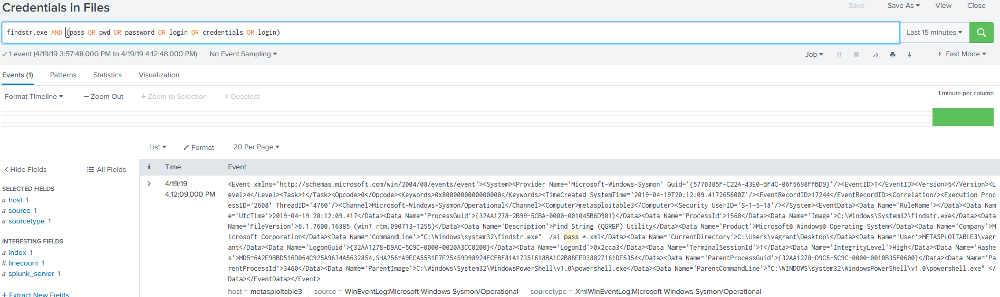

# Technique Description
## Credentials in Files - T1081
## [Description from ATT&CK](https://attack.mitre.org/techniques/T1081/)
<blockquote>
Adversaries may search local file systems and remote file shares for files containing passwords. These can be files created by users to store their own credentials, shared credential stores for a group of individuals, configuration files containing passwords for a system or service, or source code/binary files containing embedded passwords.

It is possible to extract passwords from backups or saved virtual machines through Credential Dumping. [1] Passwords may also be obtained from Group Policy Preferences stored on the Windows Domain Controller. [2]
</blockquote>

# Assumption
This assumes that malicious actors will be using cmd or powershell with findstr.exe in order to try and easily scrape the system for strings that would commonly be seen alongside a password.

# Execution
Run [credInFile.ps1](/Scripts/credInFile.ps1)

# Detection

## Visibility
Sysmon log event

## Splunk Filter
Search Term: findstr.exe AND (pass OR pwd OR password OR login OR credentials OR login)

