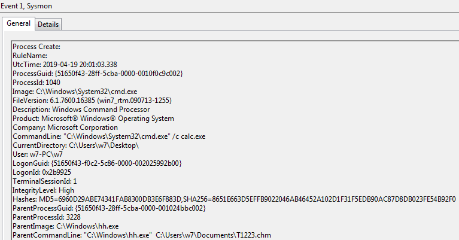

# Technique Description
## Compiled HTML File - T1223
## [Description from ATT&CK](https://attack.mitre.org/techniques/T1223/)
<blockquote>
Compiled HTML files (.chm) are commonly distributed as part of the Microsoft HTML Help system. CHM files are compressed compilations of various content such as HTML documents, images, and scripting/web related programming languages such VBA, JScript, Java, and ActiveX. [1] CHM content is displayed using underlying components of the Internet Explorer browser [2] loaded by the HTML Help executable program (hh.exe). [3]

Adversaries may abuse this technology to conceal malicious code. A custom CHM file containing embedded payloads could be delivered to a victim then triggered by User Execution. CHM execution may also bypass application whitelisting on older and/or unpatched systems that do not account for execution of binaries through hh.exe. [4] [5]
</blockquote>

# Assumption
This alert assumes that compiled HTML files executing cmd or powershell are malicious compiled HTML files.

# Execution
[Atomic Red Team test case](https://github.com/redcanaryco/atomic-red-team/tree/64ac0fea1f8641b2334340d3fdcc80b2081a6ee2/atomics/T1223)

# Detection

## Visibility
Sysmon log events

## Splunk Filter
Search Term: hh.exe AND .chm AND cmd.exe OR powershell.exe

