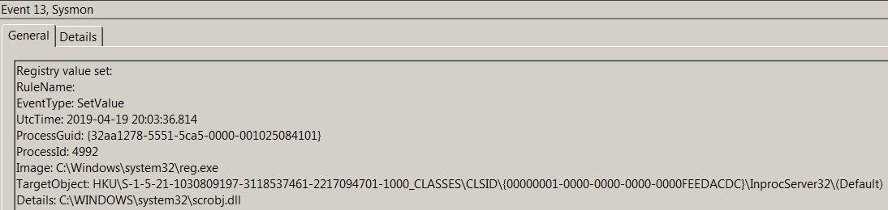
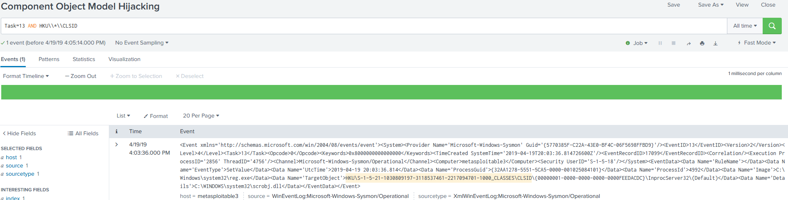

# Technique Description
##  Component Object Model Hijacking  - T1122
## [Description from ATT&CK](https://attack.mitre.org/techniques/T1122/)
<blockquote>
The [1] (COM) is a system within Windows to enable interaction between software components through the operating system. [1] Adversaries can use this system to insert malicious code that can be executed in place of legitimate software through hijacking the COM references and relationships as a means for persistence. Hijacking a COM object requires a change in the Windows Registry to replace a reference to a legitimate system component which may cause that component to not work when executed. When that system component is executed through normal system operation the adversary's code will be executed instead. [2] An adversary is likely to hijack objects that are used frequently enough to maintain a consistent level of persistence, but are unlikely to break noticeable functionality within the system as to avoid system instability that could lead to detection.
</blockquote>

# Assumption
This assumes that all COM hijacking attacks are to be done within the Current User registry hive on the system.

# Execution
[Atomic Red Team test case](https://github.com/redcanaryco/atomic-red-team/tree/6965fc15ef872281346d99d5eea952907167dec3/atomics/T1122)

# Detection

## Visibility
Sysmon log event

## Splunk Filter
Search Term: Task=13 AND HKU\\*\\CLSID

