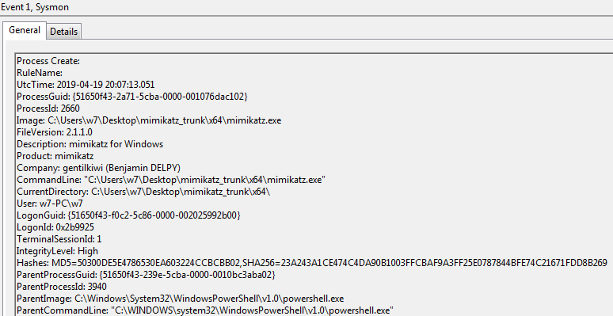
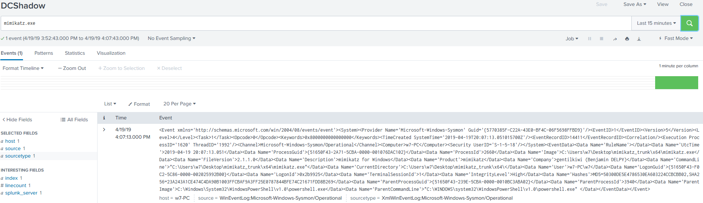

# Technique Description
## DCShadow - T1207
## [Description from ATT&CK](https://attack.mitre.org/techniques/T1207/)
<blockquote>
DCShadow is a method of manipulating Active Directory (AD) data, including objects and schemas, by registering (or reusing an inactive registration) and simulating the behavior of a Domain Controller (DC). [1] [2] Once registered, a rogue DC may be able to inject and replicate changes into AD infrastructure for any domain object, including credentials and keys.
</blockquote>

# Assumption
Any instances of mimikatz found on a system should be classified as malicious and could result in a DC shadow attack being performed on an AD environment.

# Execution
[Atomic Red Team test case](https://github.com/redcanaryco/atomic-red-team/tree/6965fc15ef872281346d99d5eea952907167dec3/atomics/T1207)

# Detection

## Visibility
Sysmon log event

## Splunk Filter
Search Term: mimikatz.exe

