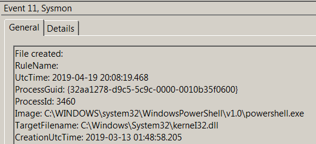
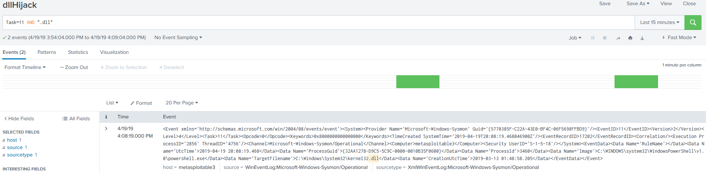

# Technique Description
## DLL Search Order Hijacking  - T1038
## [Description from ATT&CK](https://attack.mitre.org/techniques/T1038/)
<blockquote>
Windows systems use a common method to look for required DLLs to load into a program. [1] Adversaries may take advantage of the Windows DLL search order and programs that ambiguously specify DLLs to gain privilege escalation and persistence. 
</blockquote>

# Assumption
This alert assumes that the creation of new DLL files should not be happening on systems as users should not be installing new software or packages without preapproval and notice.

# Execution
Run [dllHijack.ps1](/Scripts/dllHijack.ps1)

# Detection

## Visibility
Sysmon event log

## Splunk Filter
Search Term: Task=11 AND “.dll”

