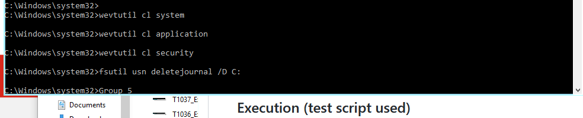

## Technique Description

This technique is used to delete or modify artifacts left on a system by the attacker in order to evade detection. Examples include modifying system logs or malware files in quarantine. One of the most prominent log locations is within the Windows event application. Adversaries can use the following commands to clear system, application, and security logs:

```wevtutil cl system```
```wevtutil cl application```
```wevtutil cl security```

## Execution (test script used)

**Potential Attacks:** 

```wevtutil cl system```
```wevtutil cl application```
```wevtutil cl security```
```fsutil usn deletejournal /D C:```




## Detection -- Visibility -- Filter/ Correlation Rule

**Filter:** 

Rule 1: ```(SourceName=Microsoft-Windows-Eventlog AND "TaskCategory=Log clear")``` \
Rule 2: ```(source="wineventlog:microsoft-windows-sysmon/operational" AND fsutil usn deletejournal AND fsutil.exe)```
