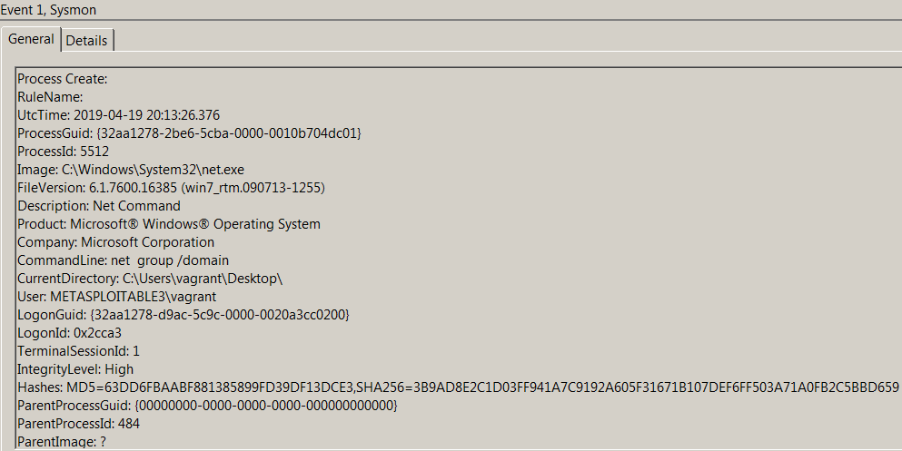
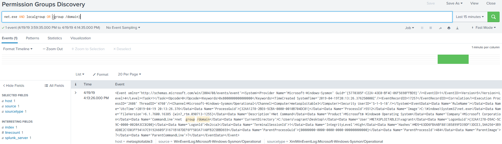

# Technique Description
## Permission Groups Discovery  - T1069
## [Description from ATT&CK](https://attack.mitre.org/techniques/T1069/)
<blockquote>
Adversaries may attempt to find local system or domain-level groups and permissions settings. 
</blockquote>

# Assumption
The attacker is using net.exe or group commands in order to determine the different groups found for a user or domain

# Execution
Run [permGroupDisco.bat](/Scripts/permGroupDisco.bat)

# Detection

## Visibility
Sysmon event log

## Splunk Filter
Search Term: net.exe AND localgroup OR (group /domain)

