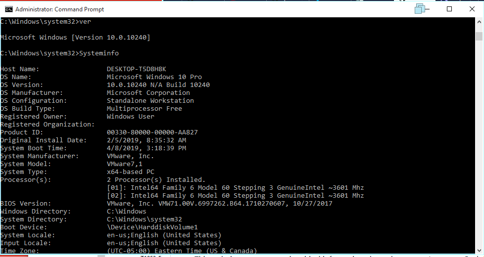

## Technique Description

This technique serves to gain critical information about the a target's system. Such information includes type of operating system, hardware specifications, service packs, and details regarding architecture. 


## Execution (test script used)

**Windows Systems:** ```ver``` ```Systeminfo```



**Mac OS:** ```systemsetup``` ```system_profiler```

## Detection -- Visibility -- Filter/ Correlation Rule

**Filter:** ```("cmd.exe" OR "powershell.exe" OR source="wineventlog:microsoft-windows-sysmon/operational" ) AND ("query" "HKLM\\SYSTEM\\CurrentControlSet\\Services\\Disk\\Enum") OR ("systeminfo")```
