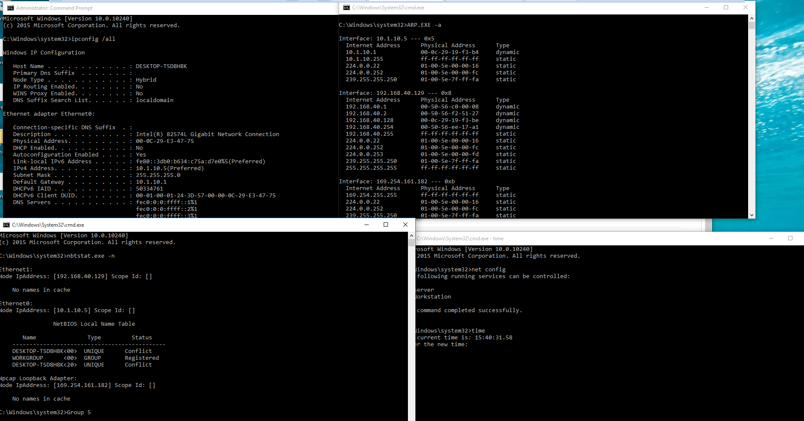

## Technique Description

Adversaries will likely look for details about the network configuration and settings of systems they access or through information discovery of remote systems. Several operating system administration utilities exist that can be used to gather this information. Examples include Arp, ipconfig/ifconfig, nbtstat, and route.


## Execution (test script used)

**Potential Attacks:** ```ipconfig /all
netsh interface show
arp -a
nbtstat -n
net config```



## Detection -- Visibility -- Filter/ Correlation Rule

**Filter:** ```("Name='CommandLine'>ipconfig  /all" OR "Name='CommandLine'>ipconfig") OR ("netsh.exe" interface ip show"" OR "ARP.EXE" OR "nbtstat.exe" OR "net1 config")```

An attacker will usually first list the interfaces using ipconfig, and then he/she might use other commands to list other network connections/sessions. 
