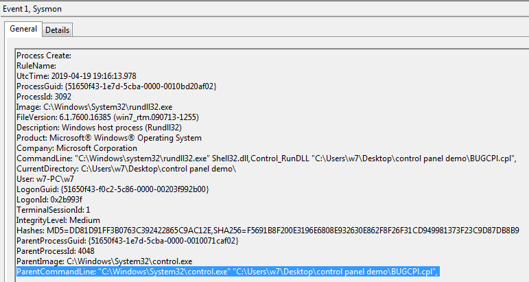

# Technique Description
##  Control Panel Items - T1196
## [Description from ATT&CK](https://attack.mitre.org/techniques/T1196/)
<blockquote>

Windows Control Panel items are utilities that allow users to view and adjust computer settings. Control Panel items are registered executable (.exe) or Control Panel (.cpl) files, the latter are actually renamed dynamic-link library (.dll) files that export a CPlApplet function. [1] [2] Control Panel items can be executed directly from the command line, programmatically via an application programming interface (API) call, or by simply double-clicking the file. [1] [2] [3]

For ease of use, Control Panel items typically include graphical menus available to users after being registered and loaded into the Control Panel. [1]

Adversaries can use Control Panel items as execution payloads to execute arbitrary commands. Malicious Control Panel items can be delivered via Spearphishing Attachment campaigns [2] [3] or executed as part of multi-stage malware. [4] Control Panel items, specifically CPL files, may also bypass application and/or file extension whitelisting.

</blockquote>

# Assumption
The assumptions for this alert are that all regular known CPL files are contained within the trustedcpl.csv file. This file acts as a baseline for anomaly detection of execution for unknown CPL files.

# Execution
Download and unzip the folder, run the BUGCPI.cpl file.

[control_panel_demo.7z](/Scripts/control_panel_demo.7z)

# Detection

## Visibility
Sysmon log entry

## Splunk Filter
Search Term: control.exe AND .cpl NOT [| inputlookup trustedcpl.csv | fields ParentCommandLine]

