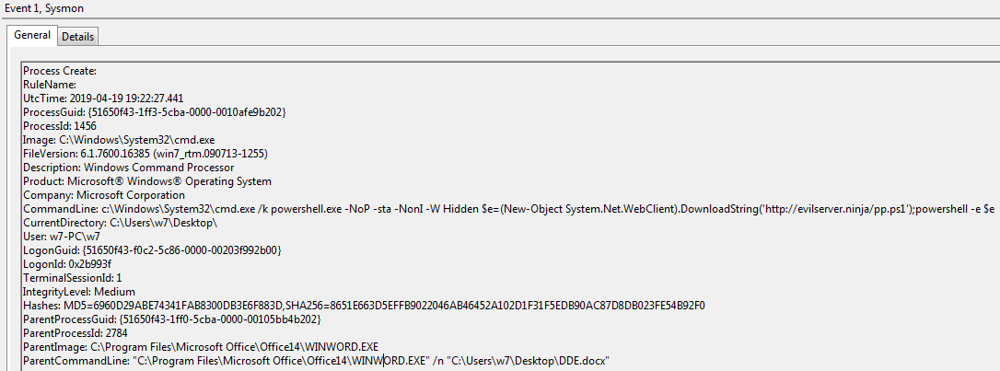
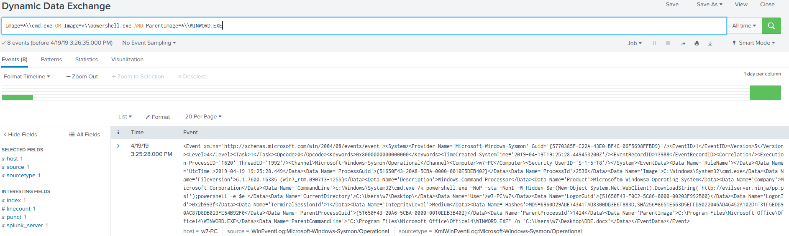

# Technique Description
## Dynamic Data Exchange - T1173
## [Description from ATT&CK](https://attack.mitre.org/techniques/T1173/)
<blockquote>

Windows Dynamic Data Exchange (DDE) is a client-server protocol for one-time and/or continuous inter-process communication (IPC) between applications. Once a link is established, applications can autonomously exchange transactions consisting of strings, warm data links (notifications when a data item changes), hot data links (duplications of changes to a data item), and requests for command execution.

Object Linking and Embedding (OLE), or the ability to link data between documents, was originally implemented through DDE. Despite being superseded by COM, DDE may be enabled in Windows 10 and most of Microsoft Office 2016 via Registry keys. [1] [2] [3]

Adversaries may use DDE to execute arbitrary commands. Microsoft Office documents can be poisoned with DDE commands [4] [5], directly or through embedded files [6], and used to deliver execution via phishing campaigns or hosted Web content, avoiding the use of Visual Basic for Applications (VBA) macros. [7] DDE could also be leveraged by an adversary operating on a compromised machine who does not have direct access to command line execution.

</blockquote>

# Assumption
This alert assumes that an attacker is performing a DDE attack within a Microsoft Word file that executes code using cmd or powershell.

# Execution
Run [DDE.docx](/Scripts/DDE.docx) and click yes on all prompts. (Note: Only works on Word 2016 and lower)

# Detection

## Visibility
Sysmon log entry

## Splunk Filter
Search Term: Image=*\\cmd.exe OR Image=*\\powershell.exe AND ParentImage=*\\WINWORD.EXE

