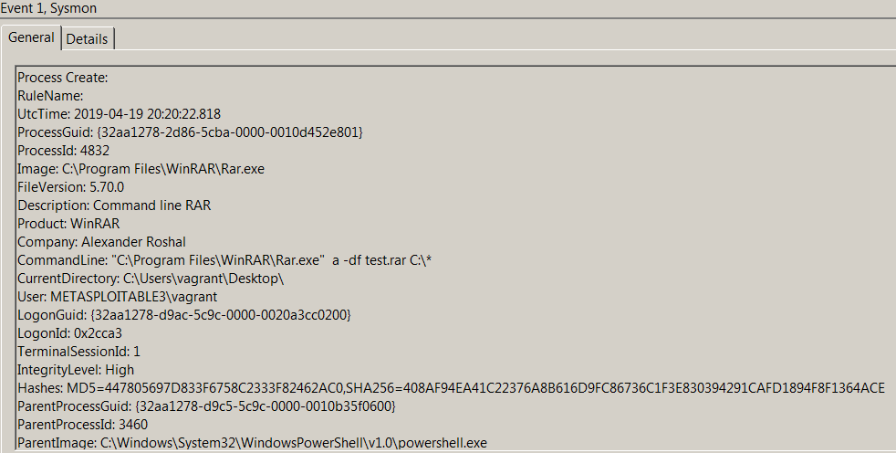
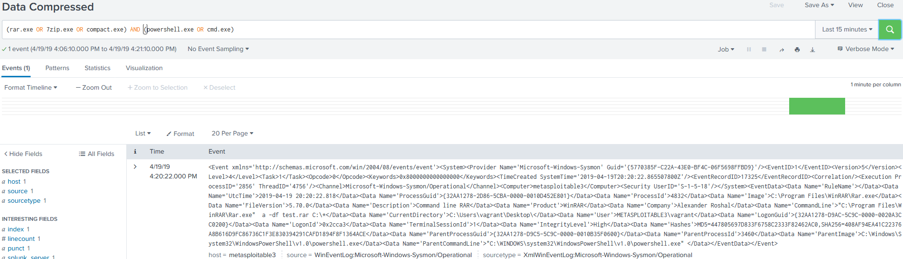

# Technique Description
## Data Compressed - T1002
## [Description from ATT&CK](https://attack.mitre.org/techniques/T1002/)
<blockquote>
An adversary may compress data (e.g., sensitive documents) that is collected prior to exfiltration in order to make it portable and minimize the amount of data sent over the network. The compression is done separately from the exfiltration channel and is performed using a custom program or algorithm, or a more common compression library or utility such as 7zip, RAR, ZIP, or zlib.
</blockquote>

# Assumption
If files are compressed on the system using the command line we can assume that this is not regular user activity as users are more inclined to use the GUI for compressing files.

# Execution
Run [compressC.ps1](/Scripts/compressC.ps1)

# Detection

## Visibility
Sysmon log entry

## Splunk Filter
Search Term: (rar.exe or 7zip.exe or compact.exe) AND (powershell.exe cmd.exe)

