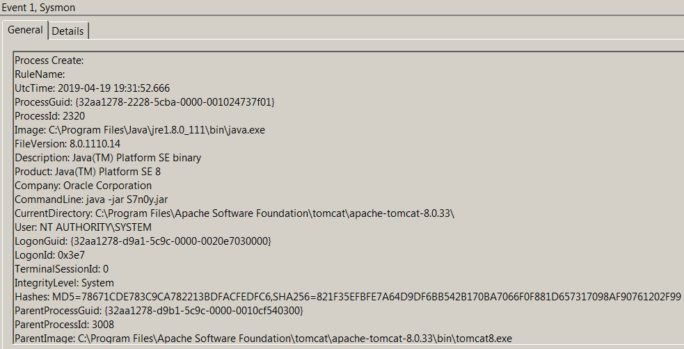
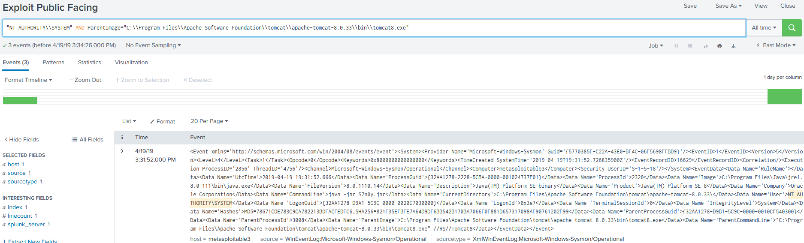

# Technique Description
##  Exploit Public-Facing Application - T1190
## [Description from ATT&CK](https://attack.mitre.org/techniques/T1190/)
<blockquote>The use of software, data, or commands to take advantage of a weakness in an Internet-facing computer system or program in order to cause unintended or unanticipated behavior. The weakness in the system can be a bug, a glitch, or a design vulnerability. These applications are often websites, but can include databases (like SQL) [1], standard services (like SMB [2] or SSH), and any other applications with Internet accessible open sockets, such as web servers and related services. [3] Depending on the flaw being exploited this may include Exploitation for Defense Evasion.</blockquote>

# Assumption
This alert assumes that you are only looking to detect exploitation of the CVE-2016-3087 vulnerability on a public facing system.

# Execution
Run Metasploit module "exploit/multi/http/struts_dni_rest_exec" against target system.

# Detection

## Visibility
Sysmon log entry

## Splunk Filter
Search Term: "NT AUTHORITY\\SYSTEM" AND ParentImage="C:\\Program Files\\Apache Software Foundation\\tomcat\\apache-tomcat-8.0.33\\bin\\tomcat8.exe"

