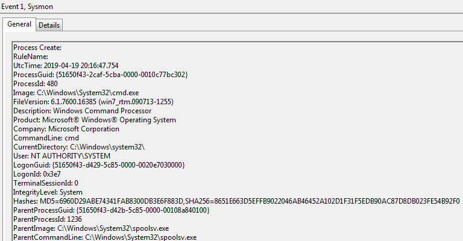
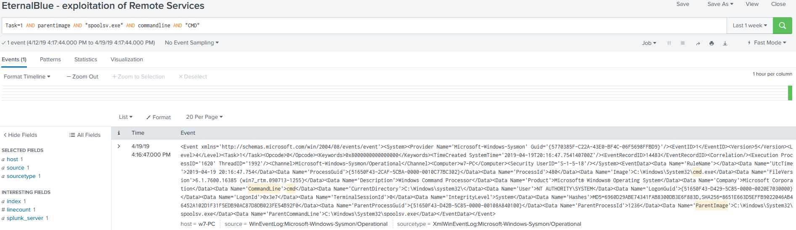

# Technique Description
## Exploitation of Remote Services - T1210
## [Description from ATT&CK](https://attack.mitre.org/techniques/T1210/)
<blockquote>
Exploitation of a software vulnerability occurs when an adversary takes advantage of a programming error in a program, service, or within the operating system software or kernel itself to execute adversary-controlled code. A common goal for post-compromise exploitation of remote services is for lateral movement to enable access to a remote system.
</blockquote>

# Assumption
This alert assumes that the attacker is using the Eternal Blue MS17-010 exploit in order to laterally move between vulnerable systems on the network.

# Execution
 Use Metasploit Module: windows/smb/ms17_010_eternalblue

# Detection

## Visibility
Sysmon log entry

## Splunk Filter
Search Term: Task=1 AND parentimage AND “spoolsv.exe” AND commandline AND “CMD”

