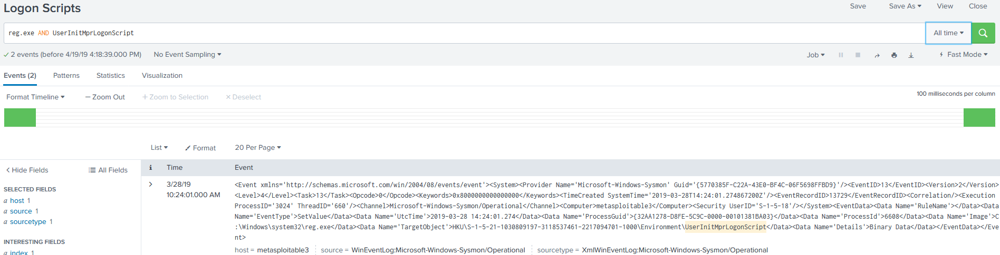
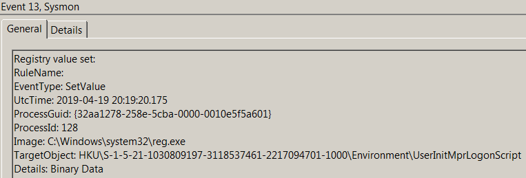

# Technique Description
## Logon Scripts - T1037
## [Description from ATT&CK](https://attack.mitre.org/techniques/T1037/)
<blockquote>
Windows allows logon scripts to be run whenever a specific user or group of users log into a system. [1] The scripts can be used to perform administrative functions, which may often execute other programs or send information to an internal logging server.

If adversaries can access these scripts, they may insert additional code into the logon script to execute their tools when a user logs in. This code can allow them to maintain persistence on a single system, if it is a local script, or to move laterally within a network, if the script is stored on a central server and pushed to many systems. Depending on the access configuration of the logon scripts, either local credentials or an administrator account may be necessary.
</blockquote>

# Assumption
This assumes that malicious logon scripts will be activated on logon by modifying values within the UserInitMprLogonScript registry key using reg.exe from the command line.

# Execution
Run [logonScripts.bat](/Scripts/logonScripts.bat)

# Detection

## Visibility
Sysmon log entry

## Splunk Filter
Search Term: reg.exe AND UserInitMprLogonScript

