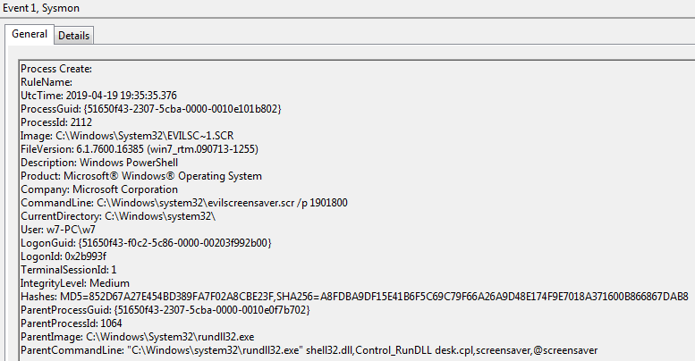
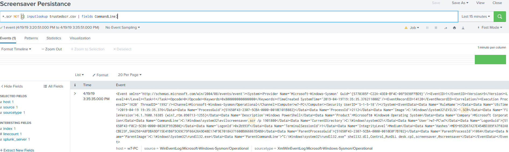

# Technique Description
## Screensaver - T1180
## [Description from ATT&CK](https://attack.mitre.org/techniques/T1180/)
<blockquote>
Screensavers are programs that execute after a configurable time of user inactivity and consist of Portable Executable (PE) files with a .scr file extension. [1] The Windows screensaver application scrnsave.exe is located in C:\Windows\System32\ along with screensavers included with base Windows installations. The following screensaver settings are stored in the Registry (HKCU\Control Panel\Desktop\) and could be manipulated to achieve persistence:

    SCRNSAVE.exe - set to malicious PE path
    ScreenSaveActive - set to '1' to enable the screensaver
    ScreenSaverIsSecure - set to '0' to not require a password to unlock
    ScreenSaverTimeout - sets user inactivity timeout before screensaver is executed

Adversaries can use screensaver settings to maintain persistence by setting the screensaver to run malware after a certain timeframe of user inactivity. [2]
</blockquote>

# Assumption
The assumptions for this alert are that all regular known CSR files are contained within the trustedcsr.csv file. This file acts as a baseline for anomaly detection of execution for unknown CSR files.

# Execution
[Atomic Red Team test case](https://github.com/redcanaryco/atomic-red-team/blob/master/atomics/T1180/T1180.md)

# Detection

## Visibility
Sysmon log entry

## Splunk Filter
Search Term: *.scr NOT [| inputlookup trustedscr.csv | fields CommandLine]

