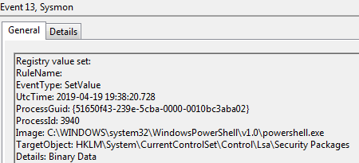
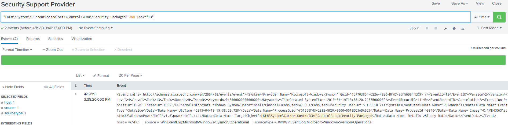

# Technique Description
##  Security Support Provider  - T1101
## [Description from ATT&CK](https://attack.mitre.org/techniques/T1101/)
<blockquote>
Windows Security Support Provider (SSP) DLLs are loaded into the Local Security Authority (LSA) process at system start. Once loaded into the LSA, SSP DLLs have access to encrypted and plaintext passwords that are stored in Windows, such as any logged-on user's Domain password or smart card PINs. The SSP configuration is stored in two Registry keys: HKLM\SYSTEM\CurrentControlSet\Control\Lsa\Security Packages and HKLM\SYSTEM\CurrentControlSet\Control\Lsa\OSConfig\Security Packages. An adversary may modify these Registry keys to add new SSPs, which will be loaded the next time the system boots, or when the AddSecurityPackage Windows API function is called. [1]
</blockquote>

# Assumption
This assumes that DLL files can only be loaded into the local security authority by creating new values within the “HKLM\System\CurrentControlSet\Control\Lsa\Security Packages” registry key.

# Execution
Run [ssp.ps1](/Scripts/ssp.ps1)

# Detection

## Visibility
Sysmon log entry

## Splunk Filter
Search Term: "HKLM\\System\\CurrentControlSet\\Control\\Lsa\\Security Packages" AND Task="13"

