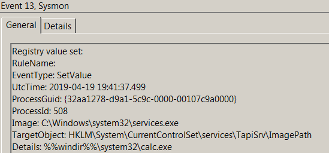
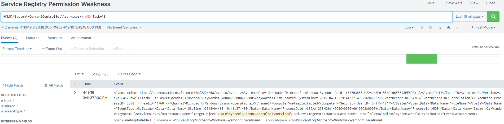

# Technique Description
## Service Registry Permissions Weakness - T1058
## [Description from ATT&CK](https://attack.mitre.org/techniques/T1058/)
<blockquote>
Windows stores local service configuration information in the Registry under HKLM\SYSTEM\CurrentControlSet\Services. The information stored under a service's Registry keys can be manipulated to modify a service's execution parameters through tools such as the service controller, sc.exe, PowerShell, or Reg. Access to Registry keys is controlled through Access Control Lists and permissions. [1]

If the permissions for users and groups are not properly set and allow access to the Registry keys for a service, then adversaries can change the service binPath/ImagePath to point to a different executable under their control. When the service starts or is restarted, then the adversary-controlled program will execute, allowing the adversary to gain persistence and/or privilege escalation to the account context the service is set to execute under (local/domain account, SYSTEM, LocalService, or NetworkService).

Adversaries may also alter Registry keys associated with service failure parameters (such as FailureCommand) that may be executed in an elevated context anytime the service fails or is intentionally corrupted. [2]
</blockquote>

# Assumption
This alert assumes that services executable paths can only be changed by adding values to the “HKLM\System\CurrentControlSet\services” registry key.

# Execution
Run [regVul.ps1](/Scripts/regVuln.ps1)

# Detection

## Visibility
Sysmon log entry

## Splunk Filter
Search Term: HKLM\\System\\CurrentControlSet\\services\\ AND Task=13

