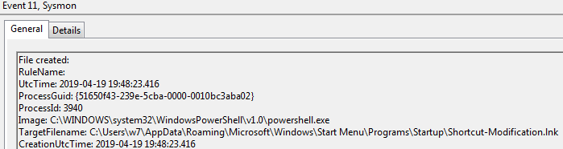
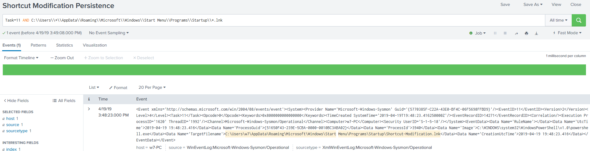

# Technique Description
## Shortcut Modification  - T1023
## [Description from ATT&CK](https://attack.mitre.org/techniques/T1023/)
<blockquote>
Shortcuts or symbolic links are ways of referencing other files or programs that will be opened or executed when the shortcut is clicked or executed by a system startup process. Adversaries could use shortcuts to execute their tools for persistence. They may create a new shortcut as a means of indirection that may use Masquerading to look like a legitimate program. Adversaries could also edit the target path or entirely replace an existing shortcut so their tools will be executed instead of the intended legitimate program.
</blockquote>

# Assumption
This assumes that only shortcuts modified within the Windows startup directory should be considered malicious. If other shortcuts are modified on the desktop for example this search will not find those events.

# Execution
Run [modLink.ps1](/Scripts/modLink.ps1)

# Detection

## Visibility
Sysmon log event

## Splunk Filter
Search Term: Task=11 AND C:\\Users\\*\\AppData\\Roaming\\Microsoft\\Windows\\Start Menu\\Programs\\Startup\\*.lnk

