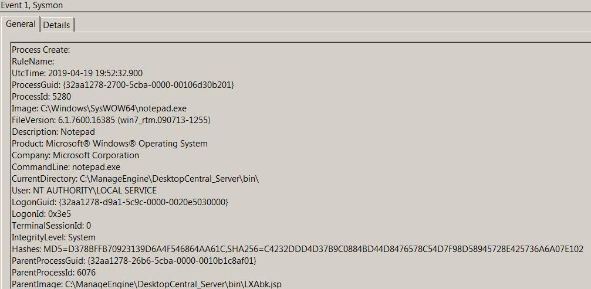
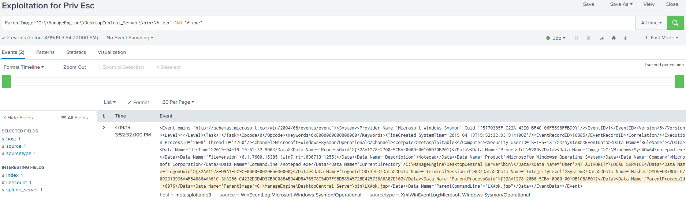

# Technique Description
##  Exploitation for Privilege Escalation  - T1068
## [Description from ATT&CK](https://attack.mitre.org/techniques/T1068/)
<blockquote>
Exploitation of a software vulnerability occurs when an adversary takes advantage of a programming error in a program, service, or within the operating system software or kernel itself to execute adversary-controlled code. Security constructs such as permission levels will often hinder access to information and use of certain techniques, so adversaries will likely need to perform Privilege Escalation to include use of software exploitation to circumvent those restrictions.
</blockquote>

# Assumption
The alert assumes that you are only looking to find privilege escalations attempts through the usage of the MS15-058 vulnerability on systems where an attacker already has user access.

# Execution

Run Metasploit modules:
- exploit/windows/http/manageengine_connectionid_write
- exploit/windows/local/ms14_058_track_popup_menu

# Detection

## Visibility
Sysmon log event

## Splunk Filter
Search Term: ParentImage="C:\\ManageEngine\\DesktopCentral_Server\\bin\\*.jsp" AND "*.exe"

