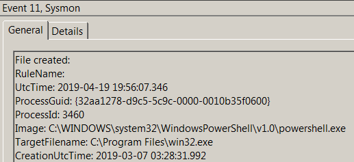
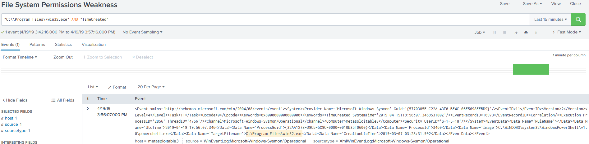

# Technique Description
## File System Permissions Weakness - T1044
## [Description from ATT&CK](https://attack.mitre.org/techniques/T1044/)
<blockquote>
Processes may automatically execute specific binaries as part of their functionality or to perform other actions. If the permissions on the file system directory containing a target binary, or permissions on the binary itself, are improperly set, then the target binary may be overwritten with another binary using user-level permissions and executed by the original process. If the original process and thread are running under a higher permissions level, then the replaced binary will also execute under higher-level permissions, which could include SYSTEM.

Adversaries may use this technique to replace legitimate binaries with malicious ones as a means of executing code at a higher permissions level. If the executing process is set to run at a specific time or during a certain event (e.g., system bootup) then this technique can also be used for persistence.
</blockquote>

# Assumption
This alert assumes that you are only looking to detect a change within the win32.exe binary. To detect the changing of other binaries a file integrity check system would offer better and more efficient protection.

# Execution
Run [filesysperm.ps1](/Scripts/filesysperm.ps1)

# Detection

## Visibility
Sysmon log event

## Splunk Filter
Search Term: "C:\\Program Files\\win32.exe" AND "TimeCreated"

